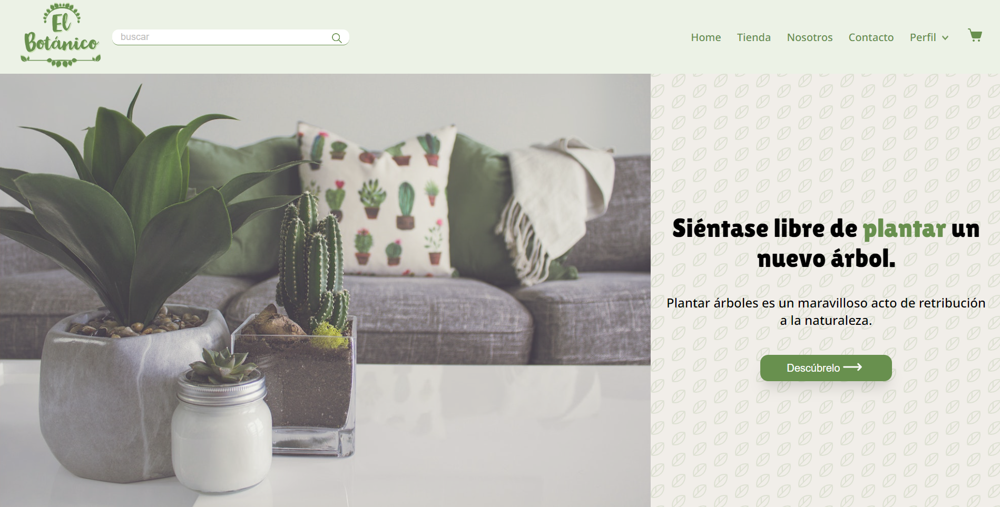
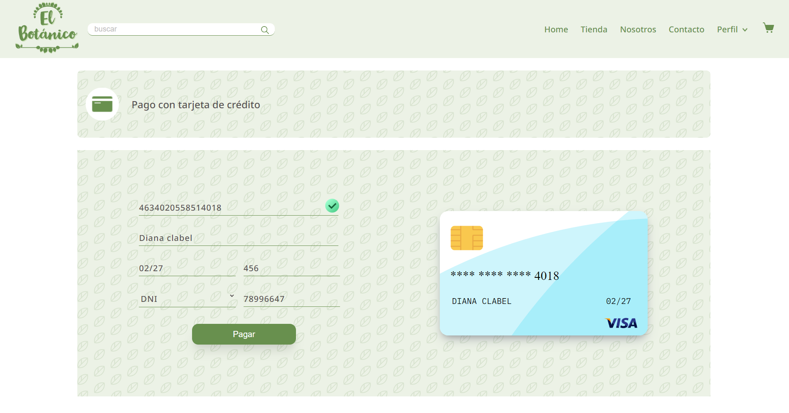
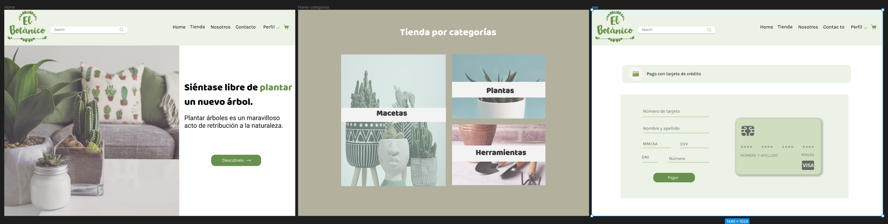

# El botánico

El botánico es una interfaz en donde puedes realizar compras de plantas, herramientas de jardinería y macetas. Lo más importante es que podrás realizar tus pagos sin preocuparte de colocar tu número de tarjeta erróneo, ya que hemos creado un validador de número de tarjeta con la metodología de Luhn para que eso no suceda y puedas realizar tus compras de manera segura.

Nuestros principales usuarios son aquellas personas interesadas en el mundo de la jardinería y que desean realizar sus compras con tarjetas de crédito de manera segura y con una interfaz muy amigable

# Uso

Para utilizar la aplicación, sigue los siguientes pasos:

- Navega a la página de inicio y selecciona tienda.
- Busca la planta que deseas comprar.
- Agrega la planta a tu carrito y dirigete a la seccion de pagar.
- Proporciona los detalles de tu tarjeta de crédito.
- Haz clic en el botón "Pagar" para procesar tu compra.

Si proporcionas una tarjeta de crédito válida, se te mostrará un aviso de que su compra fue realizada. Si proporcionas una tarjeta de crédito no válida, se te pedirá que proporciones una tarjeta de crédito válida.
#Tecnologías
El botanico es un proyecto que tiene como fin de validar una tarjeta credito antes de realizar el pago, se utilizaron las siguientes tecnologías:

- HTML
  - Uso de HTML semántico
- CSS
  - Uso de selectores de CSS
  - Modelo de caja (box model): borde, margen, padding
  - Uso de variables
- JAVASCRIPT
  - Uso de selectores del DOM
  - Manejo de eventos del DOM
  - Manipulación dinámica del DOM
  - Uso de condicionales
  - Uso de bucles/ciclos
  - Funciones (params, args, return)
  - Módulos de ECMAScript (ES Modules)
  - Pruebas unitarias (unit tests)
  - Uso de linter (ESLINT)
- FIGMA
  - Crear prototipos de alta fidelidad que incluyan interacciones
  - Seguir los principios básicos de diseño visual

# Licencia

Este proyecto está bajo la licencia MIT.

# Soporte

Si necesitas soporte para esta aplicación, puedes contactarnos a través de información de la tienda que se encuentra en nuestra página. También puedes buscar soluciones a problemas comunes en nuestra sección de preguntas frecuentes.
